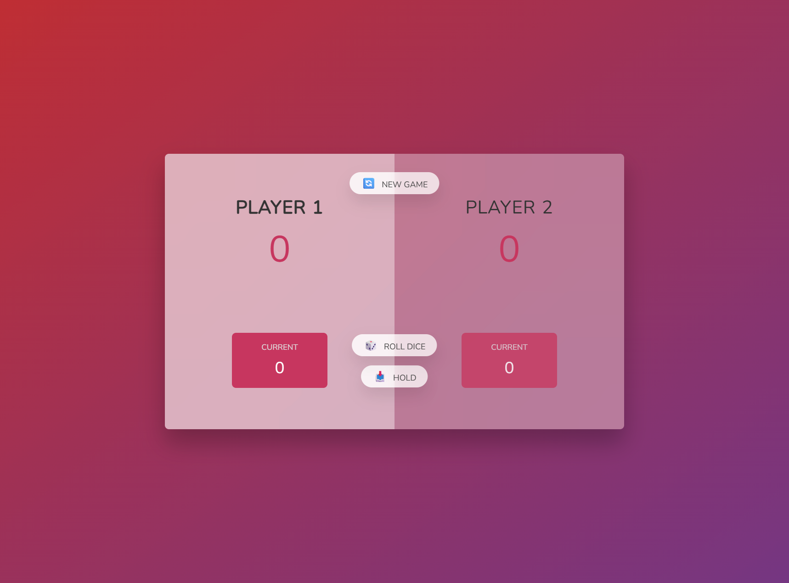

# 🎲 Pig Game (Learning Project)

  

This project is a simple **JavaScript practice game** built while following the [Jonas Schmedtmann - The Complete JavaScript Course](https://www.udemy.com/course/the-complete-javascript-course/) on Udemy.

> ⚠️ **Note:** This is not an original game idea, but a **learning exercise** from the course.  
> I coded it myself step by step to practice **DOM manipulation, events, and game logic**.

---

## 📸 Preview

  

Live Demo: [👉 Click here](https://rootblack.site/pig-game/)  

---

## 🕹️ Game Rules

1. Each turn, roll the dice and add the result to your **Current** score.  
2. If you roll a **1**, you lose all your **Current** points and turn passes to the other player.  
3. Click **Hold** to save your **Current** points into your **Total** score.  
4. The first player to reach **30 points** wins (you can change this in the code).  
5. Use **New Game** to restart.  
6. **Rules Modal:** Click the ❓ **Rules** button to open a modal window that shows the game rules in **English** and **Arabic**, with a language switcher.

---

## 🛠️ Built With
- HTML5
- CSS3 (including **responsive design**)
- Vanilla JavaScript (ES6+)

---

## 🚀 What I Learned
- DOM selection & manipulation (`querySelector`, `classList`, etc.)
- Handling **click events**
- Updating UI dynamically with JavaScript
- Basic **game logic** and state management
- Creating a responsive layout with **CSS Grid & Flexbox**
- Implementing a **Modal window** with overlay, close button, and language switch (EN/AR)

---

## 📚 Credits
- Project idea and tutorial from [Jonas Schmedtmann](https://codingheroes.io/) Udemy course.  
- Implemented and adapted by **[RootBlack](https://rootblack.site/)** as part of learning journey.

---

## 🔖 License
This code is for **educational purposes only**.  
You are free to fork and play with it while learning JavaScript.
